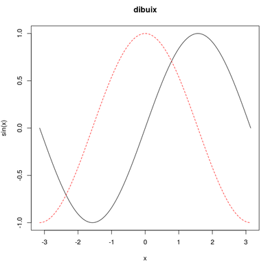

# Referències ràpides per a l'R
## Taules de sintaxis del llenguatge R 
### Elementals
|Comanda|Comentari sobre la comanda|Exemple(_Input_)|(_ouput_)|
|-------|--------------------------|--------------------------|-----------------|
|   `#`   | Serveix per ficar comentaris. | `#This is a code comment` ||
| `*` | Operador producte.| `3*2` |`[1] 6`|
|`sqrt()`|Funció arrel quadrada.| `sqrt(196)`|`[1] 14`|
|`pi`|Quocient de la longitud d'una circumferència entre el doble del seu radi.|`-pi`|`[1] -3.141593`|
|`e`|Com prefixe potència de deu| `3e2 #Thermopylae number` |`[1] 300`|
|`as.complex()`|a+bi amb a i b reals|`as.complex(-4) #-4 vist com a nombre complex` |`[1] -4+0i`|
|`i`|Unitat Complexa|`3i`|`[1] 0+3i`|
|`""`|Per donar una cadena.|`"En el Nom de Edmon"`|`[1] "En el Nom de Edmon"`|
|`T`| Variable Booleana. Veritat. |`T #TRUE`|`[1] TRUE`|
|`F`|Variable Booleana. Fals.|`F #FALSE`|`[1] FALSE`|
|`NA`|Not available, hi ha alguna dada que falta o que no té sentit, en algun lloc.|`NA #NADENA`|`[1] NA`|
|`print()`| Si afegim l'argument `quote=FALSE`, aleshores imprimeix els _Strings_ sense `'`'s o `"`'s. |`print('"', quote=FALSE)`|`[1] "`|
|`+`,`-`,`*`,`/`,`^`|Operadors bàsics, en igual odre; suma, resta, producte, quocient, potència. (**Nota:** El vectors o llistes és sumen component a component).|`(1+2-3*4/5^6)`|`[1] 2.999232`|
### Successions
|Comanda|Comentari sobre la comanda|Exemple(_Input_)|(_ouput_)|
|-------|--------------------------|--------------------------|-----------------|
|`rep()` |_Repeat_, serveix per repetir el primer argument _n_ vegades el segon argument. |`rep(":)",2) #El doble de content`|`[1] ":)" ":)"`|
|`1:10`|Successions (llista) d'enters.|`1:10 #Comptar nombre de suspesos`|` [1]  1  2  3  4  5  6  7  8  9 10`|
|`5:1`|Dóna els valors dels enters de gran a petit.|`5:1`|`[1] 5 4 3 2 1`|
|`seq(,,by=)`|Serveix per fer llistes de nombres més elaborades. Podem pensar que ens dóna fins l'enèsim nombre d'una successió. De `-pi` fins a `pi` de `0.5` en `0.5`.|`seq(-pi,pi,by=.5)`| `[1] -3.1415927 -2.6415927 -2.1415927 -1.6415927 -1.1415927 -0.6415927 [7] -0.1415927  0.3584073  0.8584073  1.3584073  1.8584073  2.3584073 [13]  2.8584073`|
|`seq(,,lenght=)`|També podem ficar  l' _especificador_ `lenght=` per demanar 10 valors equiespaiats entre dos nombres de la recta real.|`seq(-pi,pi,length=10),`|`seq(-pi,pi,length=10)`| `[1] -3.1415927 -2.4434610 -1.7453293 -1.0471976 -0.3490659  0.3490659 [7]  1.0471976  1.7453293  2.4434610  3.1415927`|
|`seq(,by=, lenght=)`|Podem combinar les dues opcions per a fer una llista de `lenght` valors de `by` en `by` a partir d'un valor donat, en aquest cas `1`.|`seq(1,by=.05,length=10)`|`[1] 1.00 1.05 1.10 1.15 1.20 1.25 1.30 1.35 1.40 1.45`|
|`espera=c("H","O","P","E")`|També podem definir un _array_/llista/vector de _Strings_.|` c("N",espera[2])`|`[1] "N" "O"`|
### _Arrays_

> Recordem la **Regla de reutilització**: si tenim dos vector de diferents mides `a` i `b`. Suposem que el vector més curt és `b`. Aleshores en fer l'operació `a*b`,`a+b`,`a-b`, etc; tenim que les operacions és fan _component a component_ i quan s'acaben les _components_ de `b`, aleshores és reciclen, en el mateix ordre, fins acabar amb totes les components de `a`.

> Exemple:
```R
> a=c(1,2,3,4);b=c(-1,1);
> a*b
[1] -1  2 -3  4
```

|Comanda|Comentari sobre la comanda|Exemple(_Input_)|(_ouput_)|
|-------|--------------------------|--------------------------|-----------------|
|`a <- c(1,0,-1,1)`|Assignar valor vectorial `c(1,0,-1,1)` a la variable `a`. La `c` ve de _concatenar_. |`a<- c(1,0,-1,1) #Forma de fer ho vella (previus versions R)`||
|`a=c(1,0,-1,1)`|Assignar valor vectorial `c(1,0,-1,1)` a la variable `a`. Sintaxis més nova. Pot no funcionar en _obsolets_. |`a=c(1,0,-1,1)`||
|`c(a,b)`|També serveix per concatenar vectors. Siguin `a=c(1,2)` i `b=c(3,4)`, llavors `c(a,b)` retornara el vector `c(1,2,3,4)`.|`c(c(1,2),c(3,4))`|`[1] 1 2 3 4`|
|`a[2]`|Retorna la segona component del vector `a`. El vector no està indexat per `0`.|`c(1,2)[1] #Suposem c(1,2)=a definit prèviament`|`[1] 1`|
|`c(1,2,4,4)[-3]`|Retorna el vector `c(1,2,4,4)` menys la darrera component,és a dir , imprimeix`[1] 1 2 4 ` . El mateix podríem pensar per `c(1,2,4,4)[-1]` que imprimeix `[1]  2 4 4 ` .|`c(1,2,4,4)[-3]`|`[1] 1 2 4`|
|`c(0,2,4,6,8,10,12,14)[3:4]`|Retorna el fragment (o components) del vector desitjat.|`c(0,2,4,6,8,10,12,14)[3:4] # Imprimira [1] 4 6`|`[1] 4 6`|
|`c(1,2,3,4,5)-1`|Vector menys un nombre, és interpretar com restar/sumar la quantitat a cada una de les components.|`c(1,2,3,4,5)-1`|`[1] 0 1 2 3 4`|
|`c(1,2,3,4,5)*2`|Producte usual de _vector_ per _escalar_.|`c(1,2,3,4,5)*2`|`[1]  2  4  6  8 10`|

### Funcions Matemàtiques
|Comanda|Comentari sobre la comanda|Exemple(_Input_)|(_ouput_)|
|-------|--------------------------|--------------------------|-----------------|
|   `max(a)` i `min(a)`   | Dóna el valor màxim, i mínim, de totes les components del vector `a`, respectivament. Això també es pot veure com la _norma infinit_.| `min(c(8,3,7)); max(c(8,3,7));` |`[1] 3 [1] 8`|
| `sum(a)` | Suma totes les components del vector `a`. |`sum(c(8,3,7));` | `[1] 18`|
| `prod(a)`| Dóna el producte de totes les components del vector `a`. |`prod(c(8,3,7));` | `[1] 168`|
| `prod(a)`| Dóna el producte de totes les components del vector `a`. |`prod(c(8,3,7));` | `[1] 168`|
| `choose (n,k)` | _n sobre k_, nombre combinatori, combinacions de agafar `k`, elements sense ordre, d'un conjunt de `n` elements. |`choose(6,4);` | `[1] 15`|
| `factorial(n)`| Dóna _n factorial_, `$n!$`. |`factorial(4); factorial(5); factorial(6);` |`[1] 24` `[1] 120` `[1] 720`|
| `lfactorial(n)`| Serveix per obtenir directament el logaritme del valor factorial. Cal recordar que `$log(n!)=log(1 \cdot 2 \cdot 3 \cdot \cdots \cdot n)=log(1)+log(2)+ \cdots +log(n)$` .| `> lfactorial(4); lfactorial(5); lfactorial(6);` |`[1] 3.178054 [1] 4.787492 [1] 6.579251`|
|   `g=function(x_1,x_2,x_3){operacions amb variables}`   | Serveix per definir noves funcions a partir de les anteriors. | `f= function(x){x^2-1};f(2); a=c(1,2,3); f(a); # Aplica funció component a component`|`[1] 3 [1] 0 3 8`|

### Gràfics
|Comentari sobre la comanda|Comanda|Gràfic|
|--------------------------|--------------------------|----|
| Representa els punts al pla que defineixen dos vector amb la mateixa longitud, un per els valor de les abscisses `OX`, i l'altre per les ordenades `OY`. |`x=c(3,1,5,3);` `y=c(1,3,3,5);` `plot(x,y);`|`#Veure PlotTypeL.png`|
| Representa una línia que uneix els punts al pla (per orde de component) que defineixen dos vector amb la mateixa longitud, un per els valor de les abscisses `OX`, i l'altre per les ordenades `OY`.|`x=c(3,1,5,3);` `y=c(1,3,3,5); plot(x,y, type="l");`|`#Veure PlotTypeL.png`|
| Per dibuixar fragments de funcions o corbes planes parametritzades. Observem que `col=2` fa referència a que el color per efectuar el gràfic és el _color 2_, que tal com podem veure, fa referència al color vermell. |`curve(exp(-x^2),from=-3,to=3,col=2)` | `#Veure CurveBellGaus.png`|
| Per introduir llegendes als gràfics de fragments de, funcions o corbes planes parametritzades. |`curve(exp(-x^2),from=-3,to=3,col=2);` `legend(’topright’,’exp(-x^2)’,lty=1,col=2);`   | `#Veure *LegendBellGauss.png`|
|Per afegir la recta horitzontal i vertical que passa pel zero, respectivament.|`curve(exp(-x^2),from=-3,to=3,col=2);abline(h=0); abline(v=0);`|`# Veure CurveLines*`| 
|Podem prescindir de `for=`i `to=` i simplement ficar els dos valors per el paràmetre després de la funció `sin(x)`. `main=dibuix` permet ficar un títol al gràfic. |`curve(sin(x),-pi,pi, main="dibuix")`|`#Veure CosSin01.png`|
|El _argument_ `add=T` (T de True i F de False) permet ficar diversos gràfics junts.`lty=2` fa referencia a _line type_ és ha dir línia tipus 2, que tal com podem veure és una línia discontinua. `col=2` ens indica que el gràfic és dibuixarà amb color vermell.|`...;` `curve(cos(x),add=T,lty=2,col=2);`|`# Veure CosSin02.png`|
|Com abans a `legend(...)`, `'topright'` indica la posició. El vector de _Strings_ indicarà el nom de les dos gràfiques sobreposades. `lty=c(1,2)` indica que el primer element de la llegenda és amb línia contínua `lty=1` i el segon amb línia discontinua `lty=2`. El color és `col=1` per negre i `col=2` per al vermell, primera i segona gràfica respectivament.|`...;` `legend('topright',c('sin(x)','cos(x)')` `,lty=c(1,2),col=c(1,2));`| `#Veure CosSin03.png`|
| Amb `abline(h=0,v=0);` afegim les rectes horitzontals `h` i verticals `v` que passen per zero `=0` al gràfic. També podem pensar que això és el mateix que ficar els eixos `OX`i `OY`.|`...;` `abline(h=0,v=0);`|`#Veure CosSin04.png`|
|Amb `point(...)` podem dibuixar punts. `-1:1` fa referencia a la regió del eix d'abscisses  que agafem per dibuixar punts, amb punts equidistants. El vector `c(0,1,0.5)` indica el nombre de punts i els valors de les ordenades.   `col=c(3,4,5)` indica els colors ; `col=3` verd,`col=4`blau, `col=5` cian.`pch=` fa referència a la forma dels punts. Potser passa el mateix que amb els colors `col=23` és el mateix que `col=7`, cicle `23-8*2=7`.|`...;`  `points(-1:1,c(0,1,0.5)` `,pch=c(18,20,22), col=c(3,4,5));`|`#Veure CosSin05.png`|
|Podem afegir més d'una gràfica en una finestra amb ` par(mfrow=c(NumFiles,NumColum))`, en aquest cas dues files i una columna `par(mfrow=c(2,1))`. |`par(mfrow=c(2,1);` `curve(sin(x),-pi,pi,lty=3,col=3);` `curve(cos(x),lty=2,col=2);`| `#Veure TwoPicturesInOne01` `TwoPicturesInOne02`|
|Podem definir el punt equiespaiats de 0 a $2\pi$ amb distància `0.1` al eix `OX`. Amb cercles o bé amb línies  `type="l"`, obtenint el mateix resultat (o bé augmentant la precisió establerta per defecte). També podriem fer servir la funció `lines(...)` |`x=seq(0,2*pi,by=0.1);` `plot(x,sin(x));` `plot(x,sin(x), type="l");` |`#Veure PlotWithSeq.png`|


#### `x=c(3,1,5,3); y=c(1,3,3,5); plot(x,y);`


#### `x=c(3,1,5,3); y=c(1,3,3,5); plot(x,y, type="l");`


#### `curve(exp(-x^2),from=-3,to=3,col=2)`


#### `curve(exp(-x^2),from=-3,to=3,col=2);` `legend(’topright’,’exp(-x^2)’,lty=1,col=2);`


#### `curve(sin(x),-pi,pi, main="dibuix"); curve(cos(x),add=T,lty=2,col=2) ;legend('topright',c('sin(x)','cos(x)'),lty=c(1,2),col=c(1,2)); abline(h=0,v=0); points(-1:1,c(0,1,0.5),pch=c(18,20,22), col=c(3,4,5));`

> **curve(sin(x),-pi,pi, main="dibuix");**


> **curve(cos(x),add=T,lty=2,col=2);**



> **legend('topright',c('sin(x)','cos(x)'),lty=c(1,2),col=c(1,2));**


> **abline(h=0,v=0);**


> **points(-1:1,c(0,1,0.5),pch=c(18,20,22), col=c(3,4,5));**


#### `par(mfrow=c(2,1);` `curve(sin(x),-pi,pi,lty=3,col=3);` `curve(cos(x),lty=2,col=2);`


#### `par(mfrow=c(2,1);` `x=seq(0,2*pi,by=0.1);` `plot(x,sin(x));` `plot(x,sin(x), type="l");`


### Bucles i condicionals
>  Una recomanació: Sempre que sigui possible, en R, usarem funcions amb vectors i evitarem l'ús de condicionals i bucles. Per qüestions d'eficiència en el temps de CPU.

#### If
> **Estructura:** `if (condicio) resultatSI else resultatNo`

**Exemple:**
```R
factorial2=function(){if(n<=170) factorial(n) else print("El nombre demanat es massa gran")}
```
>De fet podem fer servir la **mateixa sintaxis**  per el condicional que a C:
```R
factorial2=function(n){if(n<=170){factorial(n);} else{print("Nombre massa gran");}}
```
#### For
 > **Estructura:**  `for (variable en el conjunt E)` resultat. El resultat es pot posar entre claus, i si es vol en línies successives, o separades amb punts i comes a la mateixa línia;`{operacio1;operacio2;....}`.
 
**Exemple:**
Taula amb el producte dels nombres $n(n+1)(n+2)$ per $n=1, \cdots ,10$.
```R
h=rep(0,10) # vector on posarem els resultats
g=function(n){prod(n:(n+2))}
for(i in 1:10){h[i]=g(i)}
h
```
```
 [1]    6   24   60  120  210  336  504  720  990 1320
```

#### While
**Exemple:**
Ves imprimint `i` i sumant una unitat mentre `i` sigui més petit que `6`.
```R
i <- 1 #~i=1
while (i < 6){
print(i)
i = i+1
}
```

```
[1] 1
[1] 2
[1] 3
[1] 4
[1] 5
```

### Matrius
#### Omplir Matrius
|Comanda com exemple| Comentari sobre la comanda|
|-------------------|---------------------------|
|`matrix(c(1,4,2,5,3,6),nrow=2)`|**Omplir** una matriu **per columnes** especificant el nombre de files com al segon argument.|
|`matrix(c(1,2,3,4,5,6),2,byrow=T)`|Omplir una matriu especificant el nombre de columnes com a segon argument ,i com a tercer: el fet de voler-la **omplir per files**. On la `T` és una abreviatura per `True`.|
|`matrix(c(1,4,2,5,3,6),ncol=3)`|Omplir una matriu per columnes **especificant el nombre de columnes** com a segon argument.|
|`cbind(c(1,3,5),c(2,4,6))`| **Ajuntar vectors com a columnes** per formar una matriu.|
|`rbind(c(1,2,3),c(4,5,6))`|**Ajuntar vectors com a files** per formar una matriu.|

#### _Coses_ de Matrius
Sigui `A` i `B`  matrius,  `a` un vector `c(...)`, aleshores;

|Comanda com exemple| Comentari sobre la comanda|
|-------------------|---------------------------|
|`dim(A)`| Dóna les **dimensions** de la matriu `A`.|
|`ncol(A)`|Dóna les **columnes** de la matriu `A`.|
|`nrow(A)`|Dóna les **files** de la matriu `A`.|
|`length(A)`| Ens dóna el **nombre d'elements** de la matriu `A`|
|`dimnames(A)`|Si les files i columnes tenen _nom_, ens els dóna. (Veure: **Annex matrius I**).|
|`A[i,j]`| **Element** de fila `i` columna `j` de la matriu `A`.|
|`A[i,]`|Dóna la **fila** _sencera_ `i` de la matriu `A`.|
|`A[,j]`|Dóna la **columna** _sencera_ `j` de la matriu `A`.|
|`as.matrix(a)`| El vector `a` _considerat_ **com a matriu columna**.|
|`t(A)`| Dóna la matriu traspostada de `A`.|
|`A*B` i `A/B`| Fa referència al producte (o divisió) **element per element**. NO és el producte habitual.|
|`A%*%B`| **Producte de matrius** en **R**. |
|`solve(A)`|Per calcular la matriu inversa podem fer servir la funció `solve`. |

> En general farem servir la funció `solve(a,b)`  per resoldre sistemes lineals on `a` es la _matriu del sistema_ i b el _vector de terme independents_ $AX=B$.

> **Convenció en R:** posar noms separats per punts.

#### Annex matrius I (Noms de matrius)
##### Exemple (*Noms columnes i files*)
Podem ficar noms a les columnes i files d'una matriu amb l'argument `dimnames=list(NomsFiles,NomColumnes)`. Donem un primer exemple:
```R
> rnames=c("row1","row2")
> cnames=c("col1","col2","col3")
> matrix(c(1,4,2,5,3,6),nrow=2,dimnames=list(rnames,cnames)
+ )
```
```
     col1 col2 col3
row1    1    2    3
row2    4    5    6
```
##### Exemple (*Inversos dels nombres de Bernoulli*)
Donem-ne un exemple més (amb l'invers dels 8 primers nombres de _Bernoulli_ ):
```R
> A=matrix(c(1,-2,6,0,-30,0,42,0),nrow=1, dimnames=list("$B_n^{-1}$",c("n=0","n=1","n=2","n=3","n=4","n=5","n=6","n=7")))
> A
```
```
           n=0 n=1 n=2 n=3 n=4 n=5 n=6 n=7
$B_n^{-1}$   1  -2   6   0 -30   0  42   0
```
#### Annex matrius II (Un error)
Malgrat el concepte de **Regla de reutilització**, vist amb les operacions aritmètiques elementals amb _arrays_ per defecte, els elements donats per a construir una matriu, han de ser un múltiple de les columnes especificades; o en cas contrari, del nombre de files especificat. Veiem que això es cert, provant de fer el contrari, amb el següent exemple.  

```
> b=matrix(c(5,3,-1,3,1,4),nrow=2)
> b=matrix(c(5,3,-1,3,1),nrow=2)  
Warning message:
In matrix(c(5, 3, -1, 3, 1), nrow = 2) :
  data length [5] is not a sub-multiple or multiple of the number of rows [2]
```

## Exemples
### Exemple alçades
Tenim dades de les alçades (en metres) i masses (en grams) de un grup de 6 persones. I en volem calcular L'**índex de massa corporal** o *IMC*, que recordem que es defineix com _el pes_ (no com a força, amb Kg) dividit entre l'alçada (en metres) al quadrat. _Picant codi_:
```R
# Obvservem que les operacions amb vectors es fan component a component
pes=c(60,72,57,90,95,72)
alcada=c(1.75,1.80,1.65,1.90,1.74,1.91)
IMC=pes/(alcada^2)
IMC
```
``` Terminal
[1] 19.59184 22.22222 20.93664 24.93075 31.37799 19.73630
```
### Exemple _El problema del aniversari_

La probabilitat que en un grup de $n$ persones (amb $n\leq365$), almenys dues celebrin l'aniversari el mateix dia és

$$
p_n=1-P(A^c)=1- \frac{Var(365,n)}{365^n}
$$

> L'objectiu és fer un gràfic d'aquestes probabilitats en funció de $n$. 

```R
Var=function(m,n){choose(m,n)*factorial(n)} #variacions(m,n).
p=function(n){1-Var(365,n)/365^n} # Probabilitat del succés que volem observar.
n=1:100 # 1 2 3 4 5 ... 100
plot (n,p(n),type='l', col=5, add=T) # Gràfic com a "la corba que passa pels punts "
n[p(n)>=0.9] # n tal que n<=0.9
min(n[p(n)>=0.9]) # el més petit n tal que n<=0.9
abline(v=min(n[p(n)>=0.9]), col=2) # En vermell a partir d'on ja tenim 90%
```


## Exercicis
### Exercici 1
Amb els vectors `a=c(2,1,4,7)` i `b=c(4,0,-1,7)`, calculeu `c=2*a+5*b` i `d=a*b`,on aquesta darrera expressió vol dir el _producte component a component_ (producte escalar de vectors).

**Solució:**
```R
> a=c(2,1,4,7); b=c(4,0,-1,7); c=2*a+5*b; d=a*b; c; d;
[1] 24  2  3 49
[1]  8  0 -4 49
```
### Exercici 2
Escriviu una funció de `m` i `n` que calculi les variacions `Var(m, n)`. Calculeu `Var(365, 10)`. Recordem que:
```TEX
$$
Var(m,n)=frac{m!}{(m-n)!}
$$
```
**Solució:**
Si fem servir directament l'expressió obtenim l'error `Warning message:
In factorial(345) : value out of range in 'gammafn'. Però també podem escriure `$Var(m,n)={m}\choose{n} \cdot n!$`.
```R
> Var=function(m,n){choose(m,n)*factorial(n)}; Var(365,10);
[1] 3.70608e+25
```

### Exercici 3
Un llac té $N$ peixos, amb $N$ desconegut. Per tal d'estimar N fem el següent: pesquem $n_1$ peixos, els marquem i els tornem al llac. Esperem una estona i pesquem $n_2$ peixos, dels quals hi ha m de marcats. Suposem:
    * La primera vegada es pesquen $n_1=50$ peixos, qu es marquen i es tornen al llac. 
    * La segona vegada també es pesquen $n_2=50$, del quals n'hi ha $m=3$ marcats.
Designem per $p_N$ la probabilitat que, si al llac hi ha $N$ peixos, en traiem exactament 3 de marcats d'entre els 50. Tenim:

$$
p_N=\frac{{50}\chosen{3}\cdot{N-50}\choose{47}}{{N}\choose{50}}, \quad N \leq 50 .
$$
Definiu una funció que calculi aquesta probabilitat. Feu un dibuix amb $N=50, \cdots , 2000.$. Calculeu la $N$ que maximitza aquesta funció. _Indicació_: primer trobeu el màxim de $p_N$ amb la funció `max(...)`.

**Solució:**
```R
p=function(n){choose(50,3)*choose(n-50,47)*(1/choose(n,50))} # Funció probabilitat.
N=50:2000 # valors d'interès
M=c(max(N[p(N)==max(p(N))]),max(p(N))) # Punt on P_N assoleix màxim.
plot(N,p(N),type="l",col=6,main="Llac amb N peixos"); points(M[1],M[2],col=2);
abline(h=M[2],v=M[1]);
legend('bottomright',c('p_N','(833,0.238)'),lty=c(1,2),col=c(6,2)); #Gràfic
```


### Exercici 4
* Entreu les matrius
$$
A=\left(\begin{matrix}
2&3&4\\
4&0&-1\\
\end{matrix}\right)
\text{ i }
A=\left(\begin{matrix}
0&1&2\\
-3&2&1\\
\end{matrix}\right)
$$
Calculeu $C=A+B$, $D=2A$, $E=AB^t$, on aquesta útilma vol dir el producte ordinal de matrius.

* Suigui $$\left( \begin{matrix} 2&3\\4&-1\end{matrix} \right)$$ Calculeu $G=F^{-1}$
* Amb les anotacions de l'**Exercici 1** , calculeu el producte escalar dels vectors _a_ i _b_.

**Solució:**
``` R
#SolucioPrimerPunt
A=matrix(c(2,4,3,0,4,-1),3); #PitjorManeraEntrarDadees
B<-matrix(c(0,-3,1,2,2,1),ncol=3); #ElMateixQueUnIgual
C=A+B;D<-2*A;E<-A%*%t(B) 
A;B;C;D;E #Resultats
```
```
   [,1] [,2] [,3]
[1,]    2    3    4
[2,]    4    0   -1
     [,1] [,2] [,3]
[1,]    0    1    2
[2,]   -3    2    1
     [,1] [,2] [,3]
[1,]    2    4    6
[2,]    1    2    0
     [,1] [,2] [,3]
[1,]    4    6    8
[2,]    8    0   -2
     [,1] [,2]
[1,]   11    4
[2,]   -2  -13
```
```R
#SoluciosegonPunt
F<-matrix(c(2,3,4,-1),nrow=2) #MillorMoltMillor
G=solve(F) #TalQual
G;
```
```
          [,1]       [,2]
[1,] 0.07142857  0.2857143
[2,] 0.21428571 -0.1428571
```
``` R
#SolucioTercerPunt
a=matrix(c(2,1,4,7),nrow=1); b=matrix(c(4,0,-1,7),ncol=1);
a%*%b;
```
```
     [,1]
[1,]   53

```
### Exercici 5
Tenim una capsa amb 8 boles. Cinc boles tenen nombres positius $1,2,3,4,5$ i les altres boles nombres negatius $-1,-2$ i $-3$. Traiem dues boles (sense reposició). Volem calcular la probabilitat que el produce dels nombres.

**Solució habitual:**
**Solució amb R:**
```R
install.packages('combinat')
library(combinat)
```
```
Attaching package: ‘combinat’

The following object is masked from ‘package:utils’:

    combn
```
```R
urna=c(1,2,3,4,5,-1,-2,-3)
> CP=combn(urna,2)
> CP
```
```
     [,1] [,2] [,3] [,4] [,5] [,6] [,7] [,8] [,9] [,10] [,11] [,12] [,13] [,14]
[1,]    1    1    1    1    1    1    1    2    2     2     2     2     2     3
[2,]    2    3    4    5   -1   -2   -3    3    4     5    -1    -2    -3     4
     [,15] [,16] [,17] [,18] [,19] [,20] [,21] [,22] [,23] [,24] [,25] [,26]
[1,]     3     3     3     3     4     4     4     4     5     5     5    -1
[2,]     5    -1    -2    -3     5    -1    -2    -3    -1    -2    -3    -2
     [,27] [,28]
[1,]    -1    -2
[2,]    -3    -3

```
```R
CPDOS=abs(CP)+CP; #MatriuAmbZerosUtils
result=CPDOS[1,]*CPDOS[2,]; #ProductesRellevantsValenZero
length(result[result==0])/dim(CP)[2]; #ComptemZeosIDividim
```
```
> CPDOS; result; 
     [,1] [,2] [,3] [,4] [,5] [,6] [,7] [,8] [,9] [,10] [,11] [,12] [,13] [,14]
[1,]    2    2    2    2    2    2    2    4    4     4     4     4     4     6
[2,]    4    6    8   10    0    0    0    6    8    10     0     0     0     8
     [,15] [,16] [,17] [,18] [,19] [,20] [,21] [,22] [,23] [,24] [,25] [,26]
[1,]     6     6     6     6     8     8     8     8    10    10    10     0
[2,]    10     0     0     0    10     0     0     0     0     0     0     0
     [,27] [,28]
[1,]     0     0
[2,]     0     0
 [1]  8 12 16 20  0  0  0 24 32 40  0  0  0 48 60  0  0  0 80  0  0  0  0  0  0
[26]  0  0  0
```
> length(result[result==0])/dim(CP)[2];
[1] 0.6428571


